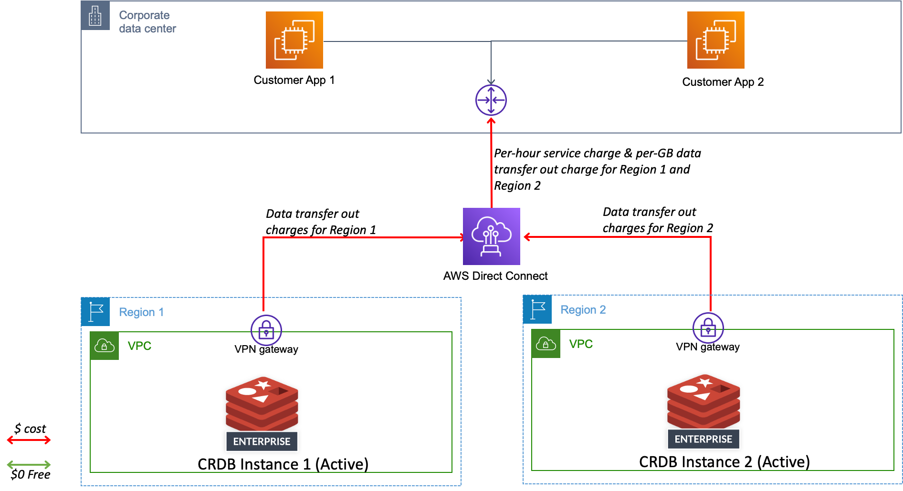
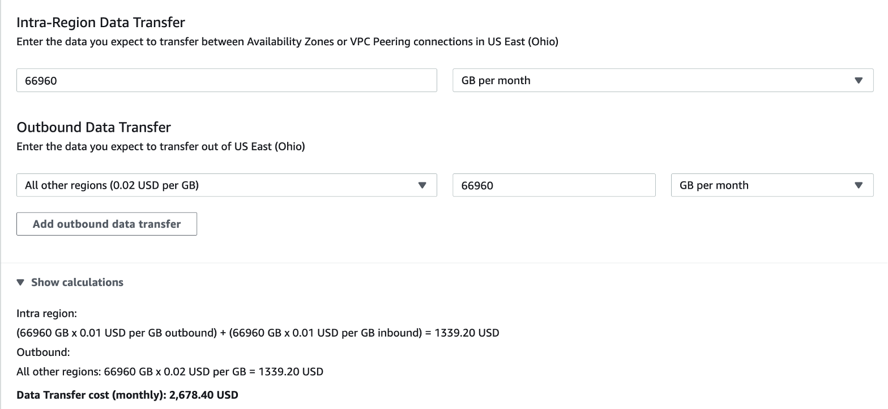

# Data Transfer Cost considerations for Redis Enterprise Cloud on AWS

## Introduction
Often times when we architect a solution using  Redis Enterprise Cloud  for a specific customer use case requirement, we tend to overlook the costs involved with data transfer operations when we bring the data in to Redis.  This document tries to help identify areas where we could incur data transfer costs while choosing deployment options for Redis Enterprise Cloud and help make Solution Design choices.

Redis Enterprise Cloud pricing services and other AWS service charges are outside the scope of this document and hence an SA is encouraged to consider those costs carefully while crafting the solution design.

## Quick recap: Redis Enterprise Cloud Deployment options
High availability in Redis is achieved with data replication and automatic failover feature. Redis Enterprise Cloud offers 3 levels of data replication.
* No replication. This will give you only a single copy of your data
* Single-zone replication. This means that the primary and replica shards are co-located in the same availability zone.
* Multi-zone replication. This gives the primary and replica shards placed across multiple availability zones, but within the same Region.

### A word about Active - Active
With A-A CRDT databases, you can truly achieve Multi-Region and even Multi-Cloud  resilience for your Redis clusters.  Your entire Redis Enterprise Cloud cluster in one Region is replicated in another Region.

Given all of these topologies, let us now examine how data transfer charges can affect in each of these deployment scenarios.

## Redis Enterprise Cloud as a fully hosted DBaaS
When Redis is hosted as a fully managed DBaaS (Database as a service), the architecture would like this:
* Notice that there are 2 AWS accounts. One that customer owns, where a customer business application is running. And the other that  Redis Inc DevOps team manages. This is where Redis Enterprise Cloud is deployed. Each account has their respective VPCs setup .
* These two environments are peered together using VPC peering technology so that the customer applications can seamlessly connect to Redis Enterprise Cloud database endpoints.
* In this scenario, any data that the customer brings in to Redis Enterprise Cloud, will incur Data transfer charges, depending upon the network topology scenarios.

### Scenario 1: Same Region + Multi-AZ case:
If Redis is deployed as a multi-zone deployment and if the customer is bringing the data from a specific AZ, inter-AZ data transfer costs may be incurred.

### Scenario 2: Same Region + Single-AZ case:
If Redis is deployed as a single-az deployment and if the customer is bringing the data from a different AZ than where Redis is deployed, that may still incur inter-AZ data transfer costs.  Hence, it always makes sense to deploy Redis in the same AZ as the customer application’s AZ.  Also, AWS does not guarantee geographical co-location of data centers, even though their name may seem exactly same. Hence, you may still incur inter-AZ costs even though externally the AZ’s nomenclature seems exactly same.

### Scenario 3: Multi-Region case:
If Redis or customer workload components communicate across multiple Regions using VPC peering connections or Transit Gateway, additional data transfer charges apply. Even if the VPCs are peered across Regions, standard inter-Region data transfer charges will still apply.

In short, you may be always paying data transfer costs when you are migrating workloads to Redis on AWS.

### Architecture Design Considerations:
* If possible, deploy Redis Enterprise Cloud in the same Region as the customer business applications.
* Zone mapping functionality seems to be not working anymore and is removed on AWS Flexible/Annual plans. Hence, for a given Region, even if you are deploying Redis Enterprise Cloud in the same region as your customer applications are, expect that the data transfer costs will be incurred.
* Leverage private endpoints that Redis Enterprise Cloud publishes to connect Customer applications. VPC peering makes this happen. If you leverage Public Endpoints, you are routing the data over Internet and surely will incur data transfer costs.

## Redis Enterprise Cloud as a non- hosted solution
When Redis Enterprise Cloud is deployed as a non-hosted solution:
1. Redis Enterprise Cloud is deployed in a Customer account.
2. Redis control plane simply manages the Redis cluster within this customer account.

All of the data is within customer AWS account and hence customer will pay data transfer costs based on how the networking topology is configured within their AWS accounts.

### Design considerations
* Use vanilla, clean slate, empty  AWS sub accounts to exclusively provision Redis Enterprise Cloud resources. This will keep things clean and easy to monitor billing / costs incurred for your cloud resources.
* Deploy Redis in the same region (ex: US East) and similar AZ (ex: us-east-1) as the business applications are running.
* Leverage private endpoints that connects using VPC peering to  avoid data hops on the public internet.
* If you are deploying A-A in multi regions, expect that per-GB charge for inter-region data transfer costs will be incurred.

## Redis deployed with Single Zone Replication
Single-zone replication implies that your database will have a primary (M1) and a replica (S1) shards are located in the same cloud zone (ex: Availability Zone 1) . If anything happens to the primary, the replica takes over and becomes the new primary.

In this case, there are no data transfer charges are incurred, as the data that is getting replicated from the primary shard (M1) to Replica (S1) is still remaining with the same availability zone.

## Redis deployed with Multi- Zone Replication
Multi-zone replication implies that your database will have a primary (M1) and a replica (S1) shards are stored in the different cloud zones (ex: Availability Zone 1 and 2) . This means that your database can remain online even if an entire zone becomes unavailable.

In this case, there are data transfer charges incurred, as the data that is getting replicated from the primary shard (M1) to Replica (S1) is crossing across the Availability Zones

## Redis Active-Active deployed with a Multi- Region Replication
With Active – Active CRDT deployments, you are choosing to run two Redis clusters across two different Regions (ex: US-East and Europe-West). A syncer continuously syncs between these two deployments and thus achieving an Active-Active deployment in place.

In addition to intra-regional data transfer costs involved, you will certainly incur inter-regional data transfer costs too.

## Redis Active-Active Hybrid or Multi-Cloud deployments
You may also choose to deploy Redis in any of the following configurations or a combination of a few:

* Semi migration:
  - You have your business applications running on-prem, but your data layer is migrated to Redis Enterprise Cloud.
* Active – Active:
  - You can have one Active Redis cluster on-prem and the other in the cloud
  - You can have both Redis clusters in the cloud
  - You can have one Redis cluster with one Cloud Service Provider (Ex: AWS) and the other with another Cloud Service Provider (Ex: GCP).

AWS offers on-prem to cloud connectivity, using any of the following services:

* AWS Site-to-Site VPN
* AWS Direct Connect

Here is a generic architecture that represents a hybrid deployment scenario. The focus here is more on data transfer costs aspect represented visually. The customer apps on-prem can also be interchanged with Redis instances representing any of the above mentioned configurations.

